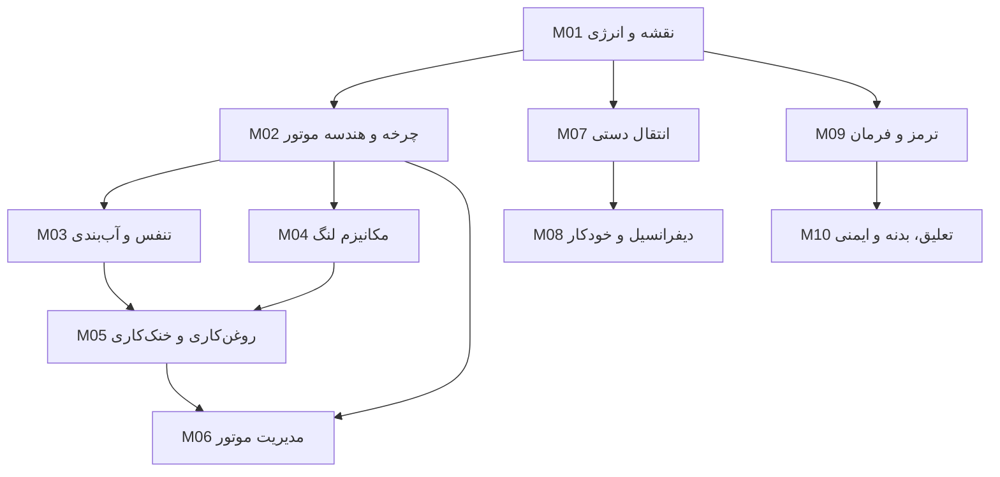

# پیشنهاد معماری آموزشی و فنی

> وضعیت: معماری مصوب Gate 1؛ نمونهٔ اصلاحی و pin دقیق stack در Gate 2 تصویب شده‌اند

## خلاصهٔ تصمیم

پیشنهاد، یک دورهٔ ده‌ماژولی با مسیر علّی «انرژی و نقشهٔ خودرو → تولید توان → نگهداری شرایط کار → کنترل موتور → انتقال توان → کنترل حرکت → تماس با جاده و ایمنی» است. بیست مقاله به ترتیب قدیمی خود کپی نمی‌شوند؛ ۱۹۶ خوشهٔ مفهومی ممیزی‌شده در این مسیر ادغام می‌شوند. یک مجموعه فایل Quarto Markdown منبع قطعی محتوا خواهد بود و دو خروجی هماهنگ می‌سازد:

- کتاب وب ایستا، پاسخ‌گو، فارسی و RTL؛
- PDF رسمی و قابل چاپ با XeLaTeX/XePersian.

این معماری در Gate 1 تصویب و با نمونهٔ اصلاحی M08 در Gate 2 تثبیت شده است.
تولید کامل ده ماژول در Phase 4 مجاز است.

## اصول طراحی

1. **سامانه پیش از قطعه:** هر ماژول با هدف، ورودی/خروجی و جریان انرژی/ماده/اطلاعات شروع می‌شود.
2. **پیش‌نیاز پیش از جزئیات:** هندسه و نیرو پیش از روغن‌کاری، سیگنال موقعیت پیش از کنترل موتور، و نیروی تایر پیش از ABS/فرمان/تعلیق می‌آید.
3. **یک توضیح مرجع:** تکرارهای مبدأ ادغام و با ارجاع متقابل جایگزین می‌شوند.
4. **تشخیص به‌عنوان استدلال:** `نشانه ← سامانه‌های ممکن ← مشاهدهٔ متمایزکننده ← آزمون ← محل محتمل عیب` در متن همان سامانه قرار می‌گیرد.
5. **تصحیح بدون تحقیر منبع:** خطای روشن طبق ردهٔ A اصلاح؛ ابهام با پل کوچک روشن؛ محتوای قدیمیِ عمدی حفظ؛ تغییر ردهٔ D فقط پس از تصویب.
6. **دانشجوی جدی، متن فشرده:** توضیح علّی و نمودار دقیق جای تزئین، بازی‌سازی و تکرار را می‌گیرد.
7. **یک منبع، دو خروجی:** متن، شناسهٔ شکل، پاورقی، پرسش و ارجاع در فایل مشترک نگهداری می‌شوند؛ تفاوت وب/PDF در presentation layer است.

## معماری آموزشی پیشنهادی

### M01 — نقشهٔ خودرو، تکامل و جریان انرژی

**نقش در کل:** زبان مشترک دوره و نقشه‌ای که هر جزء بعدی در آن جای می‌گیرد.

**منابع:** S00؛ نمای کلی S01، S09 و S19.

**اهداف یادگیری:** دانشجو بتواند:

1. نقاط عطف تاریخی را به حل یک نیاز سامانه‌ای، نه حفظ سال‌ها، پیوند دهد؛
2. هشت زیرسامانهٔ اصلی و مرزهای آن‌ها را روی خودرو نشان دهد؛
3. مسیر انرژی شیمیایی تا نیروی طولی تایر و مسیرهای جانبی حرارت/اطلاعات را دنبال کند؛
4. RWD، FWD، AWD و 4WD را در سطح نقشه و بدون تعمیم پایداری مقایسه کند؛
5. بدنه/شاسی را مسیر بار و بستر اتصال سامانه‌ها ببیند.

**بخش‌ها:** تکامل مسئله‌محور؛ نقشهٔ زیرسامانه‌ها؛ جریان انرژی/ماده/اطلاعات؛ چیدمان محرک؛ روش خواندن system map.

**سنجش نمونه:** مسیر انرژی را در یک خودروی FWD بازسازی و دو محل اتلاف/تبدیل حرارت را مشخص کند.

### M02 — چرخهٔ موتور و هندسهٔ تولید توان

**نقش در کل:** توضیح اینکه فشار گاز چگونه در یک چرخهٔ ۷۲۰ درجه‌ای توان دورانی می‌سازد.

**منابع:** S01، S02؛ پیوند کاتالیست به M06.

**اهداف یادگیری:**

1. چهار زمان را با وضعیت پیستون، سوپاپ‌ها، فشار و زاویهٔ میل‌لنگ بازسازی کند؛
2. TDC/BDC، کورس، حجم جاروب‌شده، حجم لقی و نسبت تراکم را محاسبه و تفسیر کند؛
3. تفاوت حجم، گشتاور، توان و بازده حجمی را توضیح دهد؛
4. فازبندی یک موتور چهارسیلندر و فاصلهٔ احتراق ۱۸۰ درجه را روی نمودار نشان دهد؛
5. موتور رفت‌وبرگشتی و وانکل را بر اساس مسیر حجم، قطعات متحرک و محدودیت‌ها مقایسه کند.

**بخش‌ها:** آرایش سیلندر؛ چرخه؛ هندسه و فرمول‌ها؛ چندسیلندر و فلایویل؛ مطالعهٔ مقایسه‌ای وانکل؛ جمع‌بندی مسیر گاز.

**سنجش نمونه:** از ابعاد سیلندر حجم و نسبت تراکم را بیابد و اثر تغییر حجم لقی را، بدون ادعای مستقیم دربارهٔ توان، پیش‌بینی کند.

### M03 — تنفس، زمان‌بندی و آب‌بندی محفظه

**نقش در کل:** شرایط ورود/خروج جریان و نگه‌داشتن فشار چرخه را توضیح می‌دهد.

**منابع:** S02 (زمان‌بندی)، S03، بخش رینگ‌های S05.

**اهداف یادگیری:**

1. مسیر حرکت میل‌لنگ تا سوپاپ را در OHV و OHC مقایسه کند؛
2. نسبت دور ۲:۱ و اثر تقدم/تأخر بازشدن سوپاپ بر تنفس را توضیح دهد؛
3. نقش سرسیلندر، واشر و رینگ‌ها را در جداسازی گاز، روغن و خنک‌کننده تحلیل کند؛
4. تسمه و زنجیر تایم را با معیارهای نگهداری و رجوع به OEM مقایسه کند؛
5. نشانه‌های افت تراکم/خرابی واشر را به آزمون‌های متمایزکننده تبدیل کند.

**بخش‌ها:** قطار سوپاپ؛ زمان‌بندی؛ محرک تایم؛ سرسیلندر/واشر/رینگ؛ عیب‌یابی هدایت‌شدهٔ افت آب‌بندی.

**سنجش نمونه:** برای «استارت عادی اما احتراق ضعیف» سه فرضیهٔ آب‌بندی و آزمون تفکیک‌کنندهٔ هرکدام را بنویسد.

### M04 — مکانیزم لنگ، پیستون، یاتاقان و سیلندر

**نقش در کل:** تبدیل فشار خطی به گشتاور و تحمل بار/انبساط را روشن می‌کند.

**منابع:** S04، S05؛ فلایویل S02.

**اهداف یادگیری:**

1. مسیر بار از تاج پیستون تا میل‌لنگ و بلوک را دنبال کند؛
2. نقش شاتون، گژن‌پین، لنگ، کپه و یاتاقان را روی یک مقطع مشخص کند؛
3. لقی شعاعی/محوری و شکل سرد پیستون را با انبساط حرارتی مرتبط کند؛
4. تشکیل گوهٔ هیدرودینامیک را از تماس مرزی تفکیک کند؛
5. بوش خشک/تر و پیامدهای انتقال حرارت/آب‌بندی را مقایسه کند.

**بخش‌ها:** مکانیزم لنگ؛ تکیه‌گاه و مسیر بار؛ لقی و فیلم؛ موازنه/فلایویل؛ انبساط پیستون؛ بوش‌ها.

**سنجش نمونه:** پیامد «کاهش لقی یاتاقان بدون تغییر ویسکوزیته» را در راه‌اندازی و دور کاری تحلیل کند.

### M05 — روغن‌کاری و خنک‌کاری: مدیریت اصطکاک و حرارت

**نقش در کل:** نشان می‌دهد موتور چگونه شرایط بقای قطعات را حفظ می‌کند.

**منابع:** S06، S07؛ پیوندهای S04/S05 و کنترل فن S08.

**اهداف یادگیری:**

1. SAE viscosity و API service category را از هم تفکیک و انتخاب را به OEM مشروط کند؛
2. مدار روغن را از کارتل تا گالری‌ها، یاتاقان‌ها، فیلتر و بازگشت ردیابی کند؛
3. نقش پمپ جابه‌جایی مثبت، relief، bypass و anti-drainback را توضیح دهد؛
4. مسیر خنک‌کننده، ترموستات/بای‌پس، رادیاتور، درپوش فشار و مخزن را بازسازی کند؛
5. برای چراغ فشار روغن یا افزایش دما، اقدام ایمن و توالی آزمون بسازد.

**بخش‌ها:** انتخاب روغن؛ رژیم‌های روان‌کاری؛ مدار و اجزا؛ مسیر حرارت؛ کنترل فشار/دما؛ دو سناریوی عیب‌یابی.

**سنجش نمونه:** تفاوت «فشار کم واقعی»، «سنسور معیوب» و «سطح کم» را با حداقل آزمون‌های ایمن جدا کند.

### M06 — مدیریت موتور: هوا، سوخت، جرقه و آلایندگی

**نقش در کل:** ۲۶ جزء پراکندهٔ S08 را در یک حلقهٔ حسگر–ECU–عملگر سازمان می‌دهد.

**منابع:** S08؛ اگزوز/کاتالیست S02؛ فن و دما S07.

**اهداف یادگیری:**

1. نیازهای تراکم، هوا/سوخت، جرقه و اجازهٔ راه‌اندازی را به ورودی‌های ECU وصل کند؛
2. CKP/CMP، بار/هوا، دما، دریچه، سرعت، اکسیژن و knock را بر اساس کمیت اندازه‌گیری‌شده دسته‌بندی کند؛
3. مدار سوخت، هوا، جرقه، EVAP و کاتالیست را در حلقه‌های باز/بسته توضیح دهد؛
4. DTC و live data را سرنخ بداند، نه حکم تعویض قطعه، و scan tool را از DMM/scope تفکیک کند؛
5. یک no-start را با مشاهده، فرضیه و آزمون کم‌خطر محدود کند.

**بخش‌ها:** مدل کنترل؛ تغذیه/اجازه؛ سنسورها؛ هوا و سوخت؛ جرقه؛ آلایندگی؛ ابزار تشخیص؛ مطالعهٔ موردی یکپارچه.

**سنجش نمونه:** از مجموعه دادهٔ فرضی RPM=0 هنگام استارت، CTS معقول و فشار سوخت موجود، آزمون بعدی را انتخاب و محدودیت نتیجه را بیان کند.

### M07 — چیدمان محرک، کلاچ و انتقال دستی

**نقش در کل:** کنترل و تبدیل گشتاور موتور را تا ورودی گرداننده نهایی شرح می‌دهد.

**منابع:** S09، S10، S11، بخش گاردان S12.

**اهداف یادگیری:**

1. مسیر توان را در RWD و FWD با اجزای درست رسم کند؛
2. درگیری/آزادشدن و لغزش کنترل‌شدهٔ کلاچ را با نیروهای سطح تماس توضیح دهد؛
3. نسبت دنده را محاسبه و اثر آن بر سرعت/گشتاور را با بازده تفسیر کند؛
4. مسیر توان دنده‌های جلو/عقب را در گیربکس سه‌محوره و دو‌محوره دنبال کند؛
5. جهت چرخش قطار دنده و نقش هرزگرد عقب را پیش‌بینی کند؛
6. نیاز به U-joint و sliding spline در خط انتقال طولی را استدلال کند.

**بخش‌ها:** چیدمان؛ کلاچ؛ نسبت/توان/جهت؛ گیربکس سه‌محوره؛ ترنس‌اکسل؛ گاردان.

**سنجش نمونه:** برای قطار داده‌شده، نسبت، جهت خروجی و گشتاور ایده‌آل/واقعی را محاسبه کند.

### M08 — گرداننده نهایی، دیفرانسیل و گیربکس‌های خودکار

**نقش در کل:** کاهش نهایی، تفاوت سرعت چرخ‌ها و سه راهبرد اصلی تعویض/تغییر نسبت را یکپارچه می‌کند.

**منابع:** S12، S13، S14، S15.

**اهداف یادگیری:**

1. پینیون/کرانویل، دیفرانسیل باز، پلوس و CV joint را در حرکت مستقیم و پیچ تحلیل کند؛
2. قید سرعت و محدودیت گشتاور دیفرانسیل باز را از هم جدا کند؛
3. پمپ/توربین/استاتور/lock-up مبدل گشتاور را بر اساس سرعت نسبی توضیح دهد؛
4. مجموعهٔ سیاره‌ای، کلاچ‌ها و کنترل الکتروهیدرولیک را به مسیر توان خودکار وصل کند؛
5. AT، DCT و CVT را از نظر عنصر انتقال، روش تغییر نسبت، لغزش، کنترل و مصالحه مقایسه کند؛
6. نسبت پیوستهٔ CVT را از «دنده‌های شبیه‌سازی‌شده» تفکیک کند.

**بخش‌ها:** کاهش نهایی؛ دیفرانسیل؛ نیم‌محور؛ مبدل؛ حالت‌های رانندگی؛ سیاره‌ای/کنترل؛ DCT؛ مقایسه؛ CVT.

**سنجش نمونه:** یک جدول ناشناس از سه جعبه‌دنده را از روی عنصر انتقال و روش انتخاب نسبت شناسایی و ادعاهای مطلق را نقد کند.

### M09 — ترمز، فرمان و کنترل پایداری

**نقش در کل:** نشان می‌دهد درخواست راننده چگونه به نیروهای کنترل‌شده در تماس تایر تبدیل می‌شود.

**منابع:** S16، S17؛ ABS/EBA/EBD/TCS/ESP از S19؛ پیوند به هندسهٔ M10.

**اهداف یادگیری:**

1. نیروی پدال را از اهرم/بوستر/هیدرولیک تا گشتاور ترمز دنبال کند؛
2. حد اصطکاک تایر، قفل چرخ و هدف ABS را با معادلهٔ درست توضیح دهد؛
3. حلقهٔ کاهش–نگه‌داری–افزایش فشار ABS را از دادهٔ سرعت چرخ بازسازی کند؛
4. آکرمن، نسبت فرمان و HPS/EHPS/EPS را مقایسه کند؛
5. رفتار فرمان چهارچرخ را در سرعت کم/زیاد پیش‌بینی کند؛
6. پیوند ABS، EBD، TCS و ESC را در سطح حسگر–تصمیم–عملگر ترمز تحلیل کند.

**بخش‌ها:** تولید نیرو؛ دیسک/کاسه؛ حد تایر؛ ABS؛ هندسه فرمان؛ کمک‌فرمان؛ چهارچرخ؛ نقشهٔ پایداری.

**سنجش نمونه:** توضیح دهد چرا ABS می‌تواند فرمان‌پذیری را حفظ کند ولی روی هر سطحی لزوماً مسافت را کم نمی‌کند.

### M10 — تعلیق، هندسهٔ چرخ، بدنه و ایمنی یکپارچه

**نقش در کل:** تماس تایر، حرکت بدنه، مسیر بار سازه و مدیریت انرژی تصادف را به هم وصل می‌کند.

**منابع:** S18، S19؛ پیوند S17 و M09.

**اهداف یادگیری:**

1. اهداف تماس تایر، راحتی و کنترل بدنه را با جرم فنربندی‌شده/نشده توضیح دهد؛
2. مک‌فرسون، محور صلب، نیمه‌مستقل، دوبل جناغی و بازوی دنباله‌دار را با معیار مسیر حرکت/بسته‌بندی مقایسه کند؛
3. کمبر، کستر و toe را در نمای درست تعریف و اثر تغییرشان را مشروط تحلیل کند؛
4. فنر، دمپر و سامانه‌های غیرفعال/نیمه‌فعال/فعال را تفکیک کند؛
5. body-on-frame و unibody، اتاق ایمن و crumple zone را با مسیر بار و جذب انرژی توضیح دهد؛
6. ایمنی غیرفعال، کنترل پایداری و کمک‌راننده را از اتوماسیون خودران جدا کند.

**بخش‌ها:** مأموریت؛ معماری‌ها؛ مفاصل؛ زوایا؛ فنر؛ دمپر/کنترل؛ سازه؛ تصادف؛ نقشهٔ محدود ADAS.

**سنجش نمونه:** اثر یک تغییر toe یا خرابی دمپر را از «زاویه/نیرو» تا تماس تایر، احساس راننده و الگوی سایش دنبال کند.

## دلیل توالی و ادغام



- M03 و M04 پس از M02 می‌توانند تقریباً موازی مطالعه شوند، اما هر دو پیش‌نیاز فهم خرابی‌های M05 هستند.
- M06 پس از چرخه و مدیریت حرارت می‌آید تا سنسورها فهرست قطعات نشوند.
- M07 ابتدا نسبت و مسیر توان مکانیکی را می‌سازد؛ M08 سپس راه‌حل‌های خودکار را با همان زبان مقایسه می‌کند.
- M09 نیرو در تماس تایر را می‌سازد؛ M10 نشان می‌دهد تعلیق و سازه چگونه امکان/محدودیت آن را تعیین می‌کنند.
- تاریخچه در M01 و ADAS در انتهای M10 فشرده‌اند؛ هیچ‌کدام زنجیرهٔ مکانیکی را قطع نمی‌کنند.

## نگاشت منبع به ماژول

| منبع | مقصد اصلی | مقصد پیوندی | منطق ادغام |
|---|---|---|---|
| S00 | M01 | — | تاریخچه و نقشهٔ اجزا |
| S01 | M02 | M01، M03 | هندسه/آرایش؛ نقشهٔ اجزا |
| S02 | M02 | M03، M04، M06 | چرخه؛ زمان‌بندی؛ فلایویل؛ کاتالیست |
| S03 | M03 | — | قطار سوپاپ، سرسیلندر، تشخیص |
| S04 | M04 | M05 | میل‌لنگ/یاتاقان و فیلم روغن |
| S05 | M04 | M03، M05 | پیستون/شاتون/بوش و رینگ |
| S06 | M05 | — | انتخاب روغن و مدار |
| S07 | M05 | M06 | خنک‌کاری و کنترل فن |
| S08 | M06 | M05 | حلقهٔ مدیریت موتور |
| S09 | M07 | M01، M09 | چیدمان و انتقال وزن |
| S10 | M07 | — | کلاچ |
| S11 | M07 | — | نسبت و گیربکس دستی |
| S12 | M08 | M07 | گرداننده/دیفرانسیل؛ گاردان |
| S13 | M08 | — | خودکار متعارف |
| S14 | M08 | — | DCT |
| S15 | M08 | — | CVT |
| S16 | M09 | — | ترمز/ABS |
| S17 | M09 | M10 | فرمان و هندسه |
| S18 | M10 | M09 | تعلیق/زوایا |
| S19 | M10 | M09، M01 | بدنه/ایمنی و کنترل پایداری |

نگاشت ریز ۱۹۶ مفهوم در [`CONTENT_COVERAGE_MATRIX.md`](CONTENT_COVERAGE_MATRIX.md) مرجع کنترل است؛ جدول بالا خلاصهٔ مدیریتی است.

## الگوی منعطف هر ماژول

ترتیب پیش‌فرض، با اجازهٔ حذف بخش نامتناسب:

1. نقشهٔ سامانه و جای آن در خودرو؛
2. اهداف قابل سنجش و پیش‌نیازها؛
3. جریان نیرو/حرکت/سیال/برق/اطلاعات؛
4. اجزا و توالی عملکرد؛
5. اصل فیزیکی یا محاسبهٔ ضروری؛
6. مقایسهٔ طراحی‌ها؛
7. یک الگوی خطا/تشخیص یکپارچه؛
8. خطاهای مفهومی رایج؛
9. جمع‌بندی متراکم و ۳ تا ۵ سؤال.

این الگو template اجباری بصری نیست. M01 مثلاً تشخیص فنی مفصل ندارد و M06 مطالعهٔ موردی تشخیصی پررنگ‌تری دارد.

## راهبرد سنجش

### تکوینی در هر ماژول

- یک checkpoint نموداری یا بازسازی توالی؛
- یک پرسش علّی «اگر … تغییر کند»؛
- یک مقایسه با معیارهای صریح؛
- در ماژول‌های مناسب، یک سناریوی fault isolation؛
- حداکثر ۳ تا ۵ فعالیت اصلی، بدون انبوه تست حفظی.

### پایانی

- ۱۰ مجموعهٔ جمع‌بندی ماژول؛
- یک مطالعهٔ موردی یکپارچه با سه سناریو: no-start، هشدار فشار/دما، و کنترل حرکت؛
- پاسخ‌نامهٔ جدا در PDF؛ در وب، reveal کنترل‌شده با HTML semantic و حالت بدون JavaScript قابل‌استفاده؛
- rubric کوتاه برای پرسش‌های تشریحی: مدل سامانه، رابطهٔ علّی، آزمون متمایزکننده، محدودیت نتیجه.

### توازن پیشنهادی سؤال

| نوع | سهم تقریبی |
|---|---:|
| علت و پیش‌بینی رفتار | ۳۰٪ |
| تفسیر شکل/توالی/مسیر | ۲۵٪ |
| تشخیص و انتخاب آزمون | ۲۵٪ |
| محاسبهٔ مقدماتی واحددار | ۱۵٪ |
| اصطلاح/تعریف ضروری | حداکثر ۵٪ |

## راهبرد اصطلاحات و زبان

- متن اصلی فارسی رسمی و روان؛ English equivalent فقط در نخستین کاربرد معنادار هر ماژول به‌صورت footnote.
- کلید اصطلاح canonical در یک فایل داده (پیشنهاد: `data/glossary.yml`)؛ مدخل شامل فارسی اصلی، انگلیسی، اختصار، مترادف فارسی، ماژول نخست و یادداشت bidi.
- اصطلاحات نمونهٔ اولیه: میل‌لنگ/crankshaft، نقطهٔ مرگ بالا/top dead center، گرداننده نهایی/final drive، گشتاور/torque، بازده حجمی/volumetric efficiency.
- footnote ترجمه در هر ماژول تکرارپذیر است، اما در همان ماژول فقط یک بار؛ اسکریپت lint تکرار/غیبت را گزارش می‌کند.
- اعداد فارسی در نثر؛ اعداد لاتین برای فرمول، نسبت، واحد، استاندارد، شناسه و رشته‌هایی مثل `1-3-4-2`.
- `lang="fa"`, `dir="rtl"` در ریشه؛ wrapper معنایی LTR برای فرمول، URL، کد، part number و abbreviation؛ از `bdi`/isolation و CSS logical properties استفاده می‌شود.
- نرمال‌سازی `ي/ك`، نیم‌فاصله، فاصلهٔ واحد و علائم با lint؛ جایگزینی خودکار فقط جایی که فرمول/URL را خراب نکند.

## نیاز رسانه‌ای

| ماژول | رسانهٔ ضروری | شکل پیشنهادی | اولویت |
|---|---|---|---:|
| M01 | نقشهٔ کل خودرو و جریان انرژی؛ خط زمانی کوچک | نقشهٔ برداری اصیل + عکس مجاز محدود | High |
| M02 | چرخهٔ چهارزمانه، حجم‌ها، فازبندی، وانکل | رسانهٔ فنی مجاز + sequence زمانی انتزاعی | Critical |
| M03 | OHV/OHC، valve timing، آب‌بندی سرسیلندر/رینگ | مقطع فنی مجاز + نمودار زمان‌بندی انتزاعی | Critical |
| M04 | مکانیزم لنگ، مسیر بار، گوه روغن، انبساط | مقطع فنی مجاز + overlay رابطه‌ای | Critical |
| M05 | مدار روغن و خنک‌کننده، ترموستات/درپوش | flow diagram اصیل | Critical |
| M06 | معماری ECU، نقشه سنسور/عملگر، موج/داده نمونه | system map + عکس قطعه مجاز | Critical |
| M07 | مسیر دنده، کلاچ دوحالت، جهت چرخش | رسانهٔ فنی مجاز + state/force-flow انتزاعی | Critical |
| M08 | دیفرانسیل، مبدل، سیاره‌ای، DCT، CVT | رسانهٔ مجاز؛ در نبود آن معادله/جدول/توالی | Critical |
| M09 | هیدرولیک ترمز، حلقه ABS، آکرمن، کمک‌فرمان | رسانهٔ فنی مجاز + حلقهٔ کنترل انتزاعی | Critical |
| M10 | انواع تعلیق، زوایا، دمپر، سازه/crumple | عکس/مقطع معتبر + overlay | Critical |

۱۵۸ تصویر مبدأ صرفاً فهرست audit هستند. تصمیم حقوقی Gate 1 بازنشر پیش‌فرض آن‌ها را منع کرد. شش SVG سفارشی baseline نخست M08 در بازبینی Gate 2 رد و حذف شدند؛ corrective sample سه رسانهٔ موجود با حق روشن دارد و سه نیاز دیگر را غیرتصویری حل می‌کند. manifest و سیاست در [`MEDIA_SOURCES.md`](MEDIA_SOURCES.md) آمده است.

هیچ ردیف این جدول مجوز ساخت هندسهٔ مکانیکی با AI یا کد نیست. «انتزاعی» فقط
به نمایش رابطه، جریان یا توالی بدون ادعای بازنمایی قطعهٔ واقعی گفته می‌شود.

## پشتهٔ فنی پیشنهادی

| لایه | انتخاب | دلیل |
|---|---|---|
| منبع محتوا | Quarto Book (`.qmd` + YAML data) | Markdown خوانا، فصل‌بندی، footnote/citation/cross-reference و دو خروجی از منبع مشترک |
| نسخهٔ مبنا | Quarto 1.9.38 + Pandoc 3.8.3 | نمونهٔ مشترک HTML/PDF با این دو نسخه عبور کرد؛ download و checksum در bootstrap pin شده‌اند |
| وب | HTML ایستا Quarto + SCSS/CSS logical + مقدار کم ES module | بدون سرور و hydration؛ جست‌وجو/فهرست/پیوند داخلی؛ کنترل مستقیم RTL |
| PDF | XeLaTeX در TeX Live 2023 + XePersian 24.8 | حروف‌چینی فارسی/انگلیسی، فونت، پاورقی، bookmark و کنترل کتابی؛ کتاب نهایی ۱۱۱صفحه‌ای رندر شد |
| منابع | BibTeX برای دادهٔ ممیزی + نشانگر/کتاب‌نامهٔ عددی QMD | ردیابی ۳۹/۳۹ کلید و نمایش مشترک خوانا بدون author–date یا URL خام |
| دادهٔ کمکی | YAML برای اصطلاح‌نامه و media manifest | lintپذیر و قابل استفاده در هر دو خروجی |
| اسکریپت کیفیت | Node.js LTS، بدون framework برنامه | audit منبع، lint فارسی/پوشش/لینک و orchestration کم‌پیچیدگی |
| آزمون وب | Playwright 1.61.1 + axe 4.12.1؛ Chromium 149 و Firefox ESR 140.12 | viewport، bidi، تعامل و accessibility؛ هر ۱۴ صفحه در ماتریس کامل WorkGPT عبور کرده، اما human web audit طبق تصمیم کاربر به Codex واگذار شده است |
| آزمون PDF | `qpdf`, `pdftotext`, `pdffonts`, Poppler render + بازبینی بصری | ساختار، جست‌وجوپذیری، فونت، تعداد صفحه و شکست‌های چاپ |
| بازتولیدپذیری | lockfile Node، bootstrap checksumدار و baseline TeX مستند | build محلی اثبات شده؛ تأمین کامل XeLaTeX همچنان dependency میزبان است |

### چرا SPA یا دو manuscript نه؟

محصول مسیر مطالعهٔ کتابی دارد، نه وضعیت پیچیدهٔ برنامه. React/SPA بار عملیاتی و ریسک bidi/hydration می‌افزاید بی‌آنکه ارزش آموزشی متناسب ایجاد کند. دو manuscript نیز به‌سرعت واژگان، شکل و ارجاعات را منحرف می‌کند. Quarto به‌طور رسمی از [کتاب چندفصلی](https://quarto.org/docs/books/) و [HTML/PDF](https://quarto.org/docs/output-formats/pdf-basics.html) از یک پروژه پشتیبانی می‌کند؛ [گزینهٔ `dir`](https://quarto.org/docs/reference/formats/html.html) و XeLaTeX/XePersian پایهٔ آزمون موفق نمونه بودند.

## معماری وب

- خروجی static و قابل بازکردن محلی با HTTP server ساده؛ بدون پایگاه‌داده/حساب کاربری.
- ناوبری: فهرست persistent در desktop، drawer در mobile، previous/next فارسی، breadcrumb در صورت سود.
- صفحهٔ ماژول: عنوان، system map، اهداف، بخش‌ها، ارجاعات، سنجش و پیوند پاسخ.
- search سمت client با واژگان فارسی/انگلیسی؛ حضور هر دو نوع واژه در index نمونه آزموده شد.
- رسانه: `figure`/`figcaption`، تصویر responsive، zoom با dialog دسترس‌پذیر فقط اگر واقعاً لازم؛ video با controls و poster.
- assessment reveal با `<details>` یا الگوی progressive enhancement؛ بدون JS نیز قابل خواندن.
- performance: فونت self-host با subset مجاز، تصویر responsive WebP/AVIF با fallback، lazy loading غیرcritical؛ هیچ tracker.
- URL پایدار بر اساس شناسهٔ ماژول/بخش؛ anchorهای LTR و slugهای کوتاه برای کاهش شکست bidi.
- theme چاپ وب fallback است؛ PDF رسمی از مسیر TeX تولید می‌شود.

## معماری PDF

- موتور `xelatex` و بستهٔ `xepersian`؛ class/template کمینه و تحت version control.
- PDF searchable با متن Unicode، bookmark، TOC، صفحه‌آرایی mirrored/RTL و شماره صفحهٔ پایدار.
- پاورقی‌های ترجمه و citation از همان QMD؛ running header و footer کوتاه و جهت‌آگاه.
- سیاست شکست: heading یتیم ممنوع، figure نزدیک ارجاع، longtable فقط در ضرورت، caption با شکل، پاسخ‌نامه و اصطلاح‌نامه جدا.
- تصاویر raster با وضوح چاپ و grayscale check؛ خط/برچسب برای تمایز، نه فقط رنگ.
- GIF/video با فریم کلیدی یا sequence کوتاه و URL/QR اختیاری؛ محتوای ضروری به حرکت وابسته نیست.
- preflight: فونت embedded، لینک، bookmark، متن استخراج‌پذیر، تعداد صفحه، صفحه سفید ناخواسته و رندر ۱۵۰dpi همه صفحات.
- نمونهٔ Phase 3 دشوارترین موارد را اثبات کرد و Gate 2 آن را تثبیت کرد؛ Phase 5 همان template را روی ۱۱۱ صفحه، ۱۳۸ footnote، پاسخ‌نامه، واژه‌نامه و منابع بازآزمود.

## ساختار هدف مخزن

این درخت طرح مقصد تولید بود. پیاده‌سازی نهایی اکنون در `content/m01.qmd` تا `m10.qmd`، backmatter مشترک، data manifestها و artifactهای Phase 5 ثبت شده و ساختار دقیق جاری در `README.md` آمده است:

```text
AutoMechanic/
├── _quarto.yml
├── README.md
├── PROJECT_SPEC.md
├── ARCHITECTURE_PROPOSAL.md
├── SOURCE_INVENTORY.md
├── CONTENT_COVERAGE_MATRIX.md
├── ISSUE_LEDGER.md
├── RESEARCH_LOG.md
├── MEDIA_SOURCES.md
├── TEST_PLAN.md
├── CHANGELOG.md
├── content/
│   ├── index.qmd
│   ├── modules/01-map.qmd … 10-safety.qmd
│   └── backmatter/{answers,glossary,references}.qmd
├── data/{glossary,media}.yml
├── assets/{styles,scripts,images,fonts}/
├── references/references.bib
├── print/{preamble.tex,template.tex}/
├── scripts/{audit-sources,lint-content,verify-coverage}.mjs
├── tests/{web,pdf,fixtures}/
└── _output/{web,pdf}/          # generated; not authoritative
```

نام‌های دقیق moduleهای باقی‌مانده پس از Gate 2 ثابت می‌شوند. artifact تولیدشده در git نگهداری نمی‌شود و در بستهٔ تحویل phase قرار می‌گیرد.

## برآورد صفحه و حجم

| بخش | PDF substantive pages |
|---|---:|
| پیش‌گفتار، ایمنی و راهنمای استفاده | ۴–۶ |
| M01 | ۶–۸ |
| M02 | ۹–۱۱ |
| M03 | ۸–۱۰ |
| M04 | ۸–۱۰ |
| M05 | ۸–۱۰ |
| M06 | ۱۱–۱۴ |
| M07 | ۹–۱۱ |
| M08 | ۱۳–۱۶ |
| M09 | ۱۱–۱۳ |
| M10 | ۱۳–۱۶ |
| پاسخ‌نامه، اصطلاح‌نامه، منابع و اعتبار رسانه | ۸–۱۰ |
| **کل پیش‌بینی‌شده** | **۱۰۸–۱۳۵ صفحه** |

ذخیرهٔ مدیریت ریسک تا حدود ۱۴۵ صفحه مجاز است؛ عبور از ۱۵۰ صفحه باید با گزارش علت و تصویب جدید انجام شود. هدف واژه‌ای حدود ۳۰–۳۸ هزار واژهٔ فارسی است، نه سهمیهٔ پرکردن.

نتیجهٔ واقعی: ۱۱۱ صفحهٔ A4 و ۳۰٬۱۳۲ token فاصله‌محور؛ در محدودهٔ تصویب‌شده و بدون padding محتوایی.

## مراحل تولید پیشنهادی

| مرحله | خروجی | شرط خروج |
|---|---|---|
| Gate 1 | ممیزی + معماری + تصمیم‌ها | **عبور کرده در ۲۰۲۶-۰۷-۲۱** |
| Phase 3 | M08 کامل در وب و PDF | **کامل؛ آزمون نوشتار، رسانه، اصطلاح، bidi، assessment و build عبور کرد** |
| Gate 2 | گزارش نمونه و تصمیم template/stack pin | **تصویب‌شده در ۲۰۲۶-۰۷-۲۱** |
| Phase 4A | M01–M03 + glossary seed | **کامل و کامیت‌شده** |
| Phase 4B | M04–M06 | **کامل و کامیت‌شده** |
| Phase 4C | M07–M08 | **کامل و کامیت‌شده** |
| Phase 4D | M09–M10 + backmatter | **کامل؛ پوشش ۱۰۰٪** |
| Phase 5 | خودممیزی کامل و اصلاح | **کامل؛ ۱۴۵/۱۴۵ و بازبینی ۱۱۱ صفحه** |
| Phase 6 | `CODEX_AUDIT_BRIEF.md` و artifact بازرسی | **کامل؛ audit مستقل اجرا نشده است** |

M08 در Gate 1 به‌عنوان نمونهٔ نماینده انتخاب شد؛ این ماژول تنوع نمودار، مقایسه، محاسبه و بازسازی مصوب CVT را می‌آزماید.

## ریسک‌ها و کنترل‌ها

| ریسک | احتمال / اثر | کنترل پیشنهادی | مالک تصمیم |
|---|---|---|---|
| حق اقتباس متن/تصاویر نامشخص | High / Critical | تأیید مجوز؛ عدم کپی رسانه؛ manifest کامل | کاربر |
| drift وب و PDF | Medium / High | QMD مشترک، cross-reference و build هر دو در CI | فنی |
| شکست RTL/bidi در footnote، جدول و فرمول | High / High | fixture واقعی، visual regression و sample سخت | فنی + Gate 2 |
| خطای مکانیکی در منبع | High / High | ledger A–D، منابع رسمی، بازبینی معادله/نمودار | محتوا |
| افزایش بی‌رویهٔ دامنه | Medium / High | coverage matrix، سقف صفحه و rejected expansion | معماری |
| تراکم بیش از حد M06/M08/M10 | Medium / Medium | بودجهٔ صفحه، system map و ادغام تکرار | معماری |
| پوسیدگی لینک/رسانه | Medium / Medium | local critical assets، checksum و link test | فنی/رسانه |
| فونت یا build غیرقابل بازتولید | Medium / High | مجوز/نسخه/embedding؛ pin نامزد پس از نمونه ثبت شد؛ XeLaTeX میزبان هنوز ریسک است | Gate 2 |
| سنجش کم‌عمق یا پاسخ مبهم | Medium / High | rubric، audit answer uniqueness و سؤال علّی | آموزشی |
| تحویل دستی GitHub | Low / Medium | حفظ کامیت محلی + ZIP/patch/bundle/manifest در پایان هر phase | عامل/مالک پروژه |

## تصمیم‌های ثبت‌شدهٔ Gate 1

- معماری ده‌ماژولی، محاسبات دانشگاهی مقدماتی، بازسازی CVT، طبقه‌بندی تعلیق و محدودیت ADAS مصوب‌اند.
- Quarto Book + HTML static + XeLaTeX/XePersian و اصل QMD مشترک مصوب‌اند؛ نسخه‌های اثبات‌شده در Gate 2 تثبیت شدند.
- متن‌ها به‌صورت تحول‌آفرین بازنویسی می‌شوند؛ تصویر مبدأ بدون مجوز روشن بازنشر نمی‌شود؛ تصویر مکانیکی AI و هندسهٔ قطعهٔ برنامه‌ساخته ممنوع و اولویت با رسانهٔ فنی موجود و دارای مجوز روشن است. جریان انتزاعی فقط وقتی مجاز است که وانمود به نمایش هندسه نکند.
- M08 نمونهٔ تصویب‌شدهٔ Phase 3 و خط مبنای تولید کامل است.
