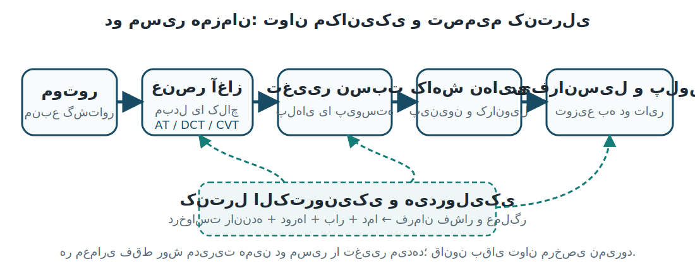
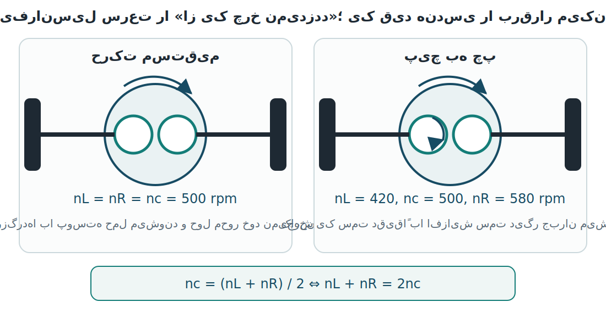
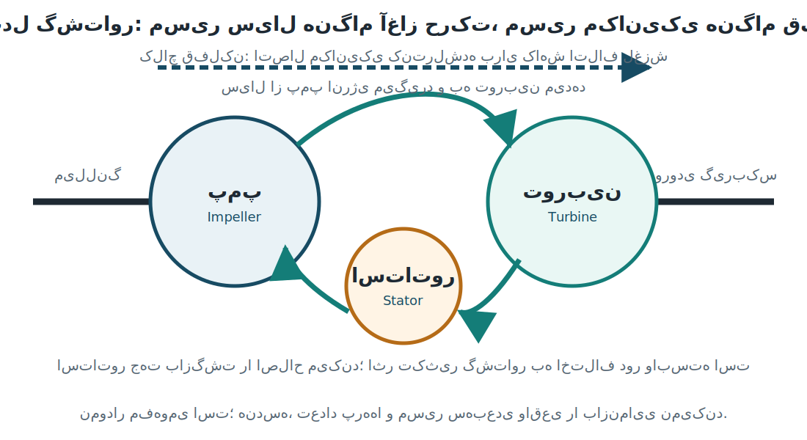
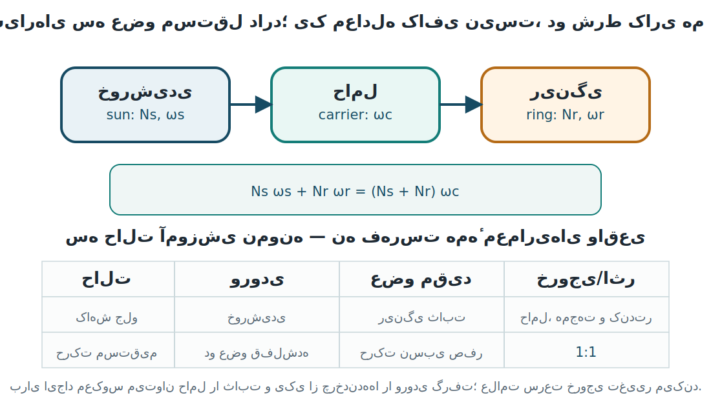
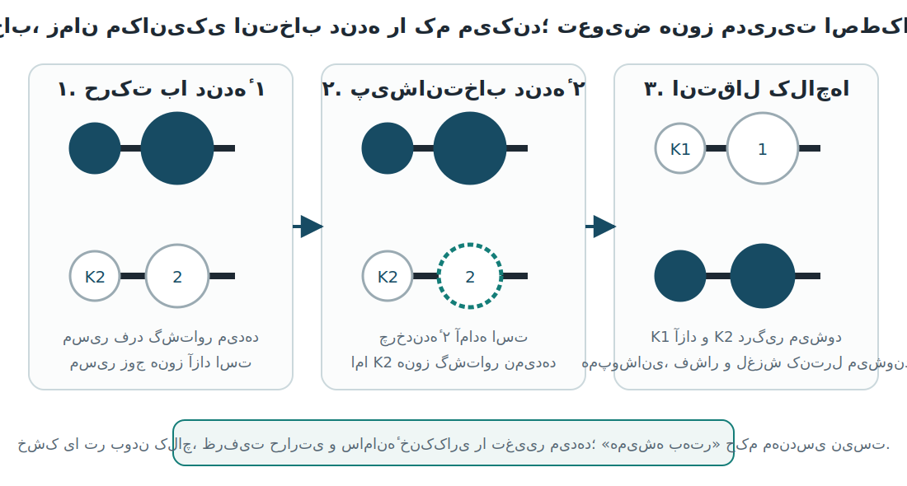
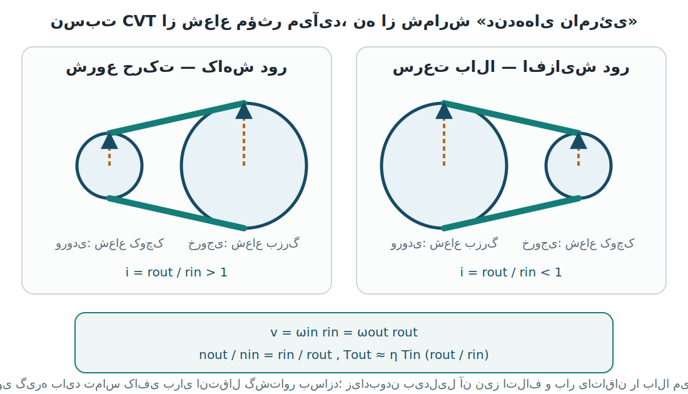

::: {.module-hero}
<p class="module-kicker">ماژول ۰۸ · انتقال قدرت</p>

گشتاور موتور برای حرکت خودرو کافی نیست؛ باید با نسبت مناسب، در زمان مناسب و از
مسیر مناسب به دو تایر محرک برسد. در این ماژول، به‌جای حفظ فهرستی از نام
گیربکس‌ها، یک زبان مشترک برای تحلیل آن‌ها می‌سازیم: **مسیر توان، قید حرکتی،
عنصر اصطکاکی و فرمان کنترل**.

<p class="module-lede">پرسش محوری: یک معماری انتقال قدرت چگونه میان آغاز نرم حرکت، شتاب، بازده، آسایش، ظرفیت حرارتی و کشش تایر سازش برقرار می‌کند؟</p>
:::

## نقشهٔ سامانه و هدف‌های یادگیری {#m08-map}

دامنهٔ موضوعی ماژول از چهار بخش پایهٔ گرداننده/دیفرانسیل، گیربکس خودکار، DCT و
CVT شکل گرفته است [@ameg-s12; @ameg-s13; @ameg-s14; @ameg-s15]. توضیح‌ها،
محاسبات و شکل‌ها برای این درس بازسازی شده‌اند و تصویر مبدأ در خروجی وجود ندارد.

{#fig-m08-system-map fig-alt="نقشه‌ای از موتور، عنصر آغاز حرکت، واحد تغییر نسبت، کاهش نهایی، دیفرانسیل و پلوس‌ها؛ واحد کنترل با خط‌چین به عنصر آغاز و تغییر نسبت فرمان می‌دهد."}

در @fig-m08-system-map دو مسیر را جدا ببینید. خط پیوسته، توان مکانیکی را حمل
می‌کند. خط‌چین، اطلاعات و فرمان را نشان می‌دهد. این جداسازی ساده جلوی یک خطای
رایج را می‌گیرد: شیر برقی «توان پیشران» تولید نمی‌کند؛ با تغییر فشار، تعیین
می‌کند کدام مسیر مکانیکی بتواند گشتاور را عبور دهد.

پس از پایان ماژول، انتظار می‌رود بتوانید:

::: {.objective-grid}
<div><strong>LO-M08-01</strong><br>مسیر گشتاور را از ورودی گیربکس تا تایرها روی یک نقشهٔ سامانه دنبال کنید.</div>
<div><strong>LO-M08-02</strong><br>نسبت کاهش، سرعت خروجی و گشتاور ایده‌آل/واقعی را با واحد و قرارداد روشن محاسبه کنید.</div>
<div><strong>LO-M08-03</strong><br>قید سرعت دیفرانسیل باز را از محدودیت کشش و توزیع گشتاور جدا کنید.</div>
<div><strong>LO-M08-04</strong><br>نقش پمپ، توربین، استاتور و کلاچ قفل‌کن را در سه حالت کاری مبدل توضیح دهید.</div>
<div><strong>LO-M08-05</strong><br>حالت یک مجموعهٔ سیاره‌ای ساده را با معادله و دو شرط کاری تحلیل کنید.</div>
<div><strong>LO-M08-06</strong><br>AT، DCT و CVT را بر پایهٔ عنصر آغاز، سازوکار نسبت، کنترل و اتلاف مقایسه کنید.</div>
<div><strong>LO-M08-07</strong><br>نسبت CVT را از شعاع‌های مؤثر استنتاج و اثر آن را بر دور و گشتاور محاسبه کنید.</div>
<div><strong>LO-M08-08</strong><br>برای یک نشانهٔ عیب، چند فرضیه بسازید و آزمونی انتخاب کنید که فرضیه‌ها را از هم جدا کند.</div>
:::

::: {.callout-note title="قرارداد این ماژول برای نسبت"}
مگر آنکه خلافش صریح نوشته شود، نسبت کاهش را به صورت
$i=n_{in}/n_{out}$ تعریف می‌کنیم. بنابراین $i>1$ یعنی خروجی کندتر و در مدل
ایده‌آل پرگشتاورتر است. نوشتن قرارداد از خود عدد مهم‌تر است؛ چون بعضی منابع
نسبت سرعت را معکوس تعریف می‌کنند.
:::

## ۸.۱ گردانندهٔ نهایی: آخرین تبدیل پیش از چرخ {#m08-final-drive}

گردانندهٔ نهایی[^final-drive] آخرین مرحلهٔ نسبت‌سازی در مسیر معمول انتقال قدرت
است. در یک محور محرک طولی، پینیون کوچک با کرانویل بزرگ درگیر می‌شود. کرانویل
به پوستهٔ دیفرانسیل بسته است؛ در نتیجه کاهش دور نهایی و چرخش پوسته با هم رخ
می‌دهند. در بسیاری از خودروهای موتورعرضی، همین کار درون ترنس‌اکسل انجام می‌شود
و شکل ظاهری مجموعه متفاوت است، اما پرسش مهندسی همان است: نسبت ورودی به پوستهٔ
دیفرانسیل چقدر است؟

اگر تعداد دندانهٔ کرانویل $Z_r$ و پینیون $Z_p$ باشد، برای یک جفت چرخ‌دندهٔ
ساده داریم:

::: {.formula-card}
$$
i_f=\frac{n_{in}}{n_c}=\frac{Z_r}{Z_p}
$$ {#eq-final-drive-ratio}

$$
n_c=\frac{n_{in}}{i_f}, \qquad
T_c \approx \eta_f\, i_f\,T_{in}
$$ {#eq-final-drive-torque}

$n_c$ دور پوستهٔ دیفرانسیل، $T_c$ گشتاور آن و $\eta_f$ بازده مرحلهٔ نهایی است.
در مدل ایده‌آل $\eta_f=1$؛ در عمل اصطکاک دندانه، یاتاقان و هم‌زدن روغن بخشی از
توان را به گرما تبدیل می‌کنند.
:::

### مثال حل‌شده: دور و گشتاور پس از کاهش نهایی

::: {.worked-example}
پینیون ۱۲ دندانه، کرانویل ۴۱ دندانه، دور ورودی
$n_{in}=3400\ \mathrm{rpm}$، گشتاور ورودی
$T_{in}=155\ \mathrm{N\,m}$ و بازده مرحله $\eta_f=0.94$ است.

ابتدا قرارداد را اعمال می‌کنیم:

$$
i_f=\frac{41}{12}=3.417
$$

پس دور پوسته و گشتاور تقریبی آن برابرند با:

$$
n_c=\frac{3400}{3.417}=995\ \mathrm{rpm}
$$

$$
T_c=0.94\times3.417\times155\approx498\ \mathrm{N\,m}
$$

کنترل انرژی: توان ورودی تقریباً $55.2\ \mathrm{kW}$ و توان خروجی تقریباً
$51.9\ \mathrm{kW}$ است؛ نسبت آن‌ها $0.94$ می‌شود. بنابراین افزایش گشتاور را
نباید «ساختن توان» تعبیر کرد؛ دور کمتر و مقداری اتلاف، بهای آن است.
:::

در محورهای محرک طولی، جفت هیپوئید[^hypoid-gear] اجازه می‌دهد محور پینیون نسبت
به مرکز کرانویل جابه‌جا باشد. این جابه‌جایی می‌تواند جانمایی میل‌گاردان و کف
خودرو را بهبود دهد، اما تماس دندانه‌ها لغزش بیشتری دارد؛ پس هندسه، پیش‌بار
یاتاقان، الگوی تماس و روغن مناسب اهمیت ویژه پیدا می‌کنند. صدای زوزه‌ای که با
سرعت خودرو تغییر می‌کند می‌تواند با درگیری نادرست دندانه یا یاتاقان مرتبط باشد،
ولی بدون جداسازی بار، سرعت، روغن و محل صدا، تشخیص قطعی نیست.

::: {.concept-check title="مکث مفهومی ۱"}
اگر نسبت نهایی از ۳٫۴ به ۴٫۱ افزایش یابد و بقیهٔ شرایط ثابت بمانند، در یک دور
موتور معین سرعت خودرو چه تغییری می‌کند؟ شتاب بالقوه و دور موتور در یک سرعت
جاده‌ای معین چطور؟ پاسخ را با واژه‌های «کاهش دور» و «مصرف/صدا» توضیح دهید، نه
فقط با «قوی‌تر» و «ضعیف‌تر».
:::

## ۸.۲ دیفرانسیل باز: یک قید سرعت، یک محدودیت کشش {#m08-differential}

دیفرانسیل باز[^open-differential] دو کار را هم‌زمان انجام می‌دهد: گشتاور را به
دو نیم‌محور می‌رساند و اجازه می‌دهد چرخ‌ها هنگام پیچیدن دور یکسان نداشته باشند.
این دو کار باید جدا تحلیل شوند. سرعت‌ها از هندسهٔ چرخ‌دنده‌ها پیروی می‌کنند؛
ظرفیت پیش‌رانش نیز به گشتاور قابل انتقال و نیروی عمودی/اصطکاک تایرها وابسته
است [@eaton-open-diff].

اجزای مدل آموزشی عبارت‌اند از پوسته یا حامل، دو چرخ‌دندهٔ جانبی متصل به
نیم‌محورها و چرخ‌دنده‌های هرزگرد. وقتی خودرو مستقیم می‌رود و دو خروجی هم‌دورند،
هرزگردها همراه پوسته حمل می‌شوند و دوران نسبی آن‌ها کم یا صفر است. در پیچ،
هرزگردها روی محور خود نیز می‌چرخند تا یک خروجی کندتر و دیگری تندتر شود.

برای دیفرانسیل متقارن ساده، قید سینماتیکی چنین است:

::: {.formula-card}
$$
n_c=\frac{n_L+n_R}{2}
$$ {#eq-open-differential}

$n_c$ سرعت پوسته، $n_L$ سرعت خروجی چپ و $n_R$ سرعت خروجی راست است. این رابطه
نمی‌گوید هر چرخ چه گشتاوری می‌گیرد؛ فقط سرعت‌ها را به هم مقید می‌کند.
:::

{#fig-differential-kinematics fig-alt="دو پنل دیفرانسیل باز. در پنل مستقیم، پوسته و هر دو چرخ ۵۰۰ دور بر دقیقه‌اند. در پیچ، پوسته ۵۰۰، چرخ چپ ۳۵۰ و چرخ راست ۶۵۰ دور بر دقیقه است و میانگین دو خروجی ۵۰۰ می‌ماند."}

در @fig-differential-kinematics اگر پوسته
$500\ \mathrm{rpm}$ بچرخد و چرخ داخلی پیچ $350\ \mathrm{rpm}$ باشد، قید بالا
دور چرخ بیرونی را تعیین می‌کند:

$$
n_R=2n_c-n_L=2(500)-350=650\ \mathrm{rpm}
$$

### چرا یک چرخ روی یخ می‌تواند خودرو را متوقف کند؟

در مدل متقارنِ دیفرانسیل باز و با صرف‌نظر از اصطکاک داخلی، گشتاور دو خروجی
تقریباً برابر است. اگر یکی از تایرها فقط گشتاور کمی را پیش از لغزش تحمل کند،
گشتاور سمت پُرچسبندگی نیز نمی‌تواند دلخواه بالا برود. چرخ کم‌چسبندگی تند می‌شود،
اما علت ناتوانی خودرو صرفاً «رفتن سرعت به آن چرخ» نیست؛ محدودیت اصلی، گشتاور
قابل‌پشتیبانی در مسیر باز و حد نیروی تایر است.

یک دیفرانسیل لغزش‌محدود می‌تواند میان دو خروجی بایاس گشتاور ایجاد کند و قفل
دیفرانسیل می‌تواند اختلاف دور را برای شرایط معین محدود سازد [@eaton-lsd]. این
دو راه‌حل یکسان نیستند و رفتارشان در پیچ، روی سطح ناهمگون و هنگام مداخلهٔ ترمز
متفاوت است. در این درس تنها مرز مفهومی آن‌ها لازم است؛ طراحی صفحات اصطکاک،
چرخ‌دندهٔ حلزونی یا کنترل فعال خارج از دامنهٔ M08 است.

::: {.diagnostic-path title="مسیر تشخیصی: صدا در پیچ"}
**مشاهده:** صدای تق‌تق با زاویهٔ فرمان و بار گاز بیشتر می‌شود.

1. آیا صدا با **سرعت چرخ** تغییر می‌کند یا با **دور موتور**؟
2. آیا در مسیر مستقیم و با همان سرعت نیز شنیده می‌شود؟
3. آیا گردگیر مفصل بیرونی پاره و گریس پاشیده شده است؟
4. آیا لقی چرخ، تایر یا اتصال تعلیق می‌تواند همان نشانه را بسازد؟

این مسیر، مفصل سرعت ثابت را به یک فرضیهٔ قوی تبدیل می‌کند؛ نه به حکم تعویض قطعه.
آزمون جاده‌ای باید در محیط امن و طبق دستورالعمل تعمیراتی خودرو انجام شود.
:::

## ۸.۳ نیم‌محور، مفصل و ترنس‌اکسل {#m08-halfshafts}

نیم‌محور یا پلوس[^half-shaft] گشتاور را از چرخ‌دندهٔ جانبی دیفرانسیل به توپی
چرخ می‌رساند. در محور صلب محرک، محفظهٔ محور می‌تواند بار سازه‌ای و جایگاه
دیفرانسیل را یکجا فراهم کند. در تعلیق مستقل یا محرک جلو، فاصله و زاویهٔ میان
دیفرانسیل و چرخ دائماً تغییر می‌کند؛ بنابراین نیم‌محور به مفصل نیاز دارد.

مفصل سرعت ثابت[^cv-joint] برای انتقال دوران در زاویه طراحی می‌شود، بی‌آنکه
نوسان سرعت زاویه‌ای شدید یک مفصل سادهٔ تک‌محوره را به خروجی تحمیل کند. مفصل
داخلی معمولاً تغییر طول مؤثر نیم‌محور را نیز می‌پذیرد و مفصل بیرونی زاویهٔ
فرمان بیشتری تحمل می‌کند. گردگیر لاستیکی قطعه‌ای کم‌هزینه اما حیاتی است: با
پارگی آن، گریس خارج و آلودگی وارد مسیر تماس می‌شود؛ ادامهٔ کار می‌تواند سایش و
صدا را شتاب دهد.

ترنس‌اکسل[^transaxle] نام یک آرایش یکپارچه است، نه یک نوع نسبت‌ساز مستقل.
گیربکس دستی، خودکار، DCT یا CVT می‌تواند همراه گردانندهٔ نهایی و دیفرانسیل در
یک پوستهٔ مشترک ساخته شود. پس جملهٔ «این خودرو ترنس‌اکسل دارد» هنوز نمی‌گوید
نسبت‌ها چگونه ایجاد یا کنترل می‌شوند.

## ۸.۴ مبدل گشتاور: آغاز حرکت با سیال {#m08-torque-converter}

در بسیاری از گیربکس‌های خودکار پله‌ای، مبدل گشتاور[^torque-converter] میان
موتور و مجموعهٔ نسبت‌ساز قرار دارد. پوسته و پمپ به موتور متصل‌اند؛ توربین به
محور ورودی گیربکس وصل است؛ استاتور مسیر برگشت سیال را تغییر می‌دهد. این سامانه
یک جفت چرخ‌دنده با نسبت ثابت نیست. رفتار آن به اختلاف دور پمپ و توربین، شکل
پره‌ها، دبی و شرایط کنترل وابسته است [@middelmann1999; @zf2019].

{#fig-torque-converter fig-alt="نمودار مفهومی مبدل گشتاور. پمپ سمت موتور، توربین سمت گیربکس و استاتور پایین آن‌هاست. پیکان سبز حلقهٔ جریان سیال و خط‌چین آبی مسیر کلاچ قفل‌کن را نشان می‌دهد."}

### سه حالت برای فهم رفتار

1. **آغاز حرکت یا اختلاف دور زیاد:** پمپ سیال را شتاب می‌دهد و توربین هنوز کند
   است. جریان برگشتی می‌تواند با استاتور تغییر جهت دهد و واکنش استاتور، افزایش
   گشتاور توربین را ممکن کند. مقدار افزایش یک عدد همگانی نیست.
2. **نزدیک‌شدن دورها:** با تندشدن توربین، مسیر و اندازهٔ حرکت نسبی سیال تغییر
   می‌کند. تکثیر گشتاور کم می‌شود و مبدل بیشتر مانند کوپلینگ سیالی رفتار می‌کند.
3. **قفل کنترل‌شده:** کلاچ قفل‌کن[^lockup-clutch] پوسته و توربین را از مسیر
   اصطکاکی به هم نزدیک یا متصل می‌کند تا لغزش و گرمایش کمتر شود. در برخی
   راهبردها قفل کامل نیست و لغزش کوچکِ کنترل‌شده برای میرایی ارتعاش حفظ می‌شود.

::: {.callout-warning title="لغزش، هم قابلیت است و هم اتلاف"}
لغزش مبدل اجازه می‌دهد خودرو در توقف با موتور روشن بماند و آغاز حرکت نرم شود؛
همان لغزش، توان را به گرما تبدیل می‌کند. بنابراین دمای سیال، ظرفیت خنک‌کاری،
فشار اعمال کلاچ قفل‌کن و وضعیت روغن گیربکس به هم مربوط‌اند. رنگ یا بوی روغن
به‌تنهایی علت عیب را ثابت نمی‌کند و مشخصات/سطح روغن باید طبق روش سازنده بررسی
شود.
:::

### مثال انرژی: لغزش در حالت کوپلینگ

فرض کنید در یک لحظه پمپ $2200\ \mathrm{rpm}$ و توربین
$1980\ \mathrm{rpm}$ دارد. لغزش نسبی دور به‌صورت زیر است:

$$
\begin{aligned}
s &= \frac{n_p-n_t}{n_p}\times100 \\
  &= \frac{2200-1980}{2200}\times100=10\%
\end{aligned}
$$

این محاسبه فقط اختلاف دور را بیان می‌کند. برای محاسبهٔ گرمای واقعی باید
گشتاور، مدت، رفتار جریان و بازده را نیز بدانیم. اگر کلاچ قفل‌کن در همین حالت
فرمان بگیرد اما دورها به هم نزدیک نشوند، فرضیه‌ها می‌توانند لغزش کلاچ، فشار
ناکافی، فرمان نامناسب یا اندازه‌گیری نادرست دور باشند.

## ۸.۵ انتخاب‌های راننده: فرمان، نه توصیف کامل معماری {#m08-selectors}

حروف روی انتخابگر، درخواست راننده را به کنترل‌کننده می‌رسانند. رفتار دقیق به
طراحی خودرو وابسته است، اما معنای عمومی چنین است:

::: {.table-responsive}
| حالت | درخواست عمومی | نکتهٔ تحلیلی و ایمنی |
|---|---|---|
| [P]{.ltr} | پارک و درگیری ضامن مکانیکی پارک | جای ترمز پارک و مهار خودرو را نمی‌گیرد؛ درگیری در حرکت می‌تواند آسیب‌زا باشد. |
| [R]{.ltr} | حرکت معکوس | مسیر معکوس می‌تواند با مجموعهٔ سیاره‌ای یا دندهٔ جدا ساخته شود؛ روش تعویض خودرو‌ویژه است. |
| [N]{.ltr} | قطع مسیر پیشران | به معنی قطع همهٔ اجزای در حال دوران یا بی‌نیازی از ترمز نیست. |
| [D]{.ltr} | حرکت جلو با انتخاب خودکار نسبت | کنترل‌کننده بر پایهٔ سرعت، بار، دما و درخواست راننده تصمیم می‌گیرد. |
| حالت دستی | درخواست افزایش/کاهش نسبت توسط راننده | «تیپ‌ترونیک» یک نام تجاری شناخته‌شده است، نه نام عمومی همهٔ حالت‌های دستی؛ رفتار `+ / −` و حدهای حفاظتی طبق سازنده است. |
:::

حالت‌های برف، اسپرت و اقتصادی نیز دستورهای یکسان جهانی نیستند. راهبرد برف ممکن
است گشتاور چرخ را ملایم‌تر کند؛ حالت اسپرت ممکن است دنده را دیرتر عوض کند و دور
موتور را بالا نگه دارد؛ حالت اقتصادی معمولاً پاسخ را آرام‌تر و تعویض/قفل را
برای کاهش مصرف تنظیم می‌کند. ادعای اینکه حالت اسپرت همواره مصرف را کم می‌کند
یا یک حالت خاص همیشه از دندهٔ معینی شروع می‌شود، بدون دفترچهٔ همان خودرو معتبر
نیست.

## ۸.۶ مجموعهٔ سیاره‌ای: سه عضو و دو شرط کاری {#m08-planetary}

مجموعهٔ سیاره‌ای[^planetary-gearset] ساده از چرخ‌دندهٔ خورشیدی، چرخ‌دندهٔ رینگی
داخلی، چند سیاره و حامل آن‌ها تشکیل می‌شود. مزیت معماری، هم‌محوری ورودی و
خروجی‌ها و امکان ساخت چند حالت با مقیدکردن یا اتصال عضوهاست. اما نام قطعات به
تنهایی نسبت را تعیین نمی‌کند.

برای تعداد دندانهٔ خورشیدی $N_s$، تعداد دندانهٔ رینگی $N_r$ و سرعت‌های زاویه‌ای
$\omega_s$، $\omega_r$ و $\omega_c$، رابطهٔ بنیادی مجموعهٔ ساده چنین است
[@li2012]:

::: {.formula-card}
$$
N_s\omega_s+N_r\omega_r=(N_s+N_r)\omega_c
$$ {#eq-planetary}

این یک معادله برای سه سرعت مجهول است. بنابراین حالت واقعی فقط وقتی تعیین می‌شود
که **دو شرط مستقل دیگر** بدانیم؛ برای مثال کدام عضو ورودی است و کدام عضو با ترمز
ثابت شده، یا کدام دو عضو با کلاچ به هم قفل شده‌اند.
:::

{#fig-planetary-map fig-alt="سه جعبهٔ خورشیدی، حامل و رینگی با معادلهٔ سرعت میان آن‌ها. جدول پایین، کاهش جلو با رینگی ثابت، حرکت مستقیم با قفل دو عضو و معکوس با حامل ثابت را خلاصه می‌کند."}

### مثال حل‌شده: کاهش جلو با رینگی ثابت

فرض کنید $N_s=30$، $N_r=70$، خورشیدی ورودی با
$\omega_s=2400\ \mathrm{rpm}$ و رینگی ثابت است؛ پس $\omega_r=0$.

$$
30(2400)+70(0)=(30+70)\omega_c
$$

$$
\omega_c=720\ \mathrm{rpm}
$$

حامل هم‌جهت ورودی و کندتر می‌چرخد. نسبت کاهش از خورشیدی به حامل
$i=2400/720=3.33$ است. اگر فقط می‌گفتیم «یکی از عضوها همیشه ثابت است»، حالت
مستقیمِ قفل‌شده یا معماری‌های مرکب را بد توضیح می‌دادیم. در بسیاری از حالت‌های
پایه یک عضو واقعاً ثابت می‌شود؛ اما اصل عام این است که کنترل‌کننده باید شرایط
کافی برای مسیر توان ایجاد کند.

### عنصرهای اصطکاکی و ساخت حالت‌ها {#m08-friction-elements}

عنصر اصطکاکی[^friction-element] می‌تواند دو عضو دوّار را به هم وصل کند یا یک عضو
را نسبت به پوسته نگه دارد. کلاچ چندصفحه‌ای معمولاً اتصال دو مسیر چرخان و ترمز
چندصفحه‌ای یا باند، مقیدکردن یک عضو را بر عهده دارد. اعمال فشار، صفحات را به هم
می‌فشارد؛ ظرفیت گشتاور به ضریب اصطکاک، نیروی فشاری، شعاع مؤثر، شمار سطوح و
وضعیت حرارتی وابسته است.

هنگام تعویض، آزادشدن یک عنصر و گرفتن عنصر دیگر باید زمان‌بندی شود. اگر عنصر
جاری زود آزاد و بعدی دیر درگیر شود، دور موتور می‌تواند بالا بپرد. اگر هر دو با
گشتاور زیاد هم‌زمان بگیرند، قفل متقابل و ضربه ممکن است رخ دهد. هم‌پوشانی
کنترل‌شده میان این دو حد قرار می‌گیرد. این منطق در AT و DCT شکل فیزیکی متفاوتی
دارد، اما مسئلهٔ بنیادی مشترک است: گشتاور از یک مسیر اصطکاکی به مسیر دیگر تحویل
می‌شود.

## ۸.۷ کنترل الکتروهیدرولیکی: از حس‌کردن تا فشار {#m08-control}

واحد کنترل گیربکس[^tcu] سرعت ورودی و خروجی، موقعیت پدال، بار موتور، دمای سیال،
وضعیت انتخابگر و فرمان‌های شبکه را می‌خواند. سپس نسبت مطلوب، زمان تعویض، فشار
خط و الگوی کلاچ‌ها را انتخاب می‌کند. شیر برقی[^solenoid] این تصمیم الکتریکی را
به تغییر مسیر یا فشار هیدرولیک تبدیل می‌کند.

یک مدل پنج‌مرحله‌ای برای تحلیل کافی است:

1. **اندازه‌گیری:** حسگرها حالت جاری را گزارش می‌کنند.
2. **تصمیم:** کنترل‌کننده حالت هدف و محدودیت حفاظتی را تعیین می‌کند.
3. **فرمان:** جریان یا چرخهٔ کاری شیر برقی تغییر می‌کند.
4. **هیدرولیک:** فشار و دبی در مدار مربوط تغییر می‌کنند.
5. **مکانیک:** کلاچ/ترمز گشتاور را عبور می‌دهد و دورها پاسخ می‌دهند؛ حسگرها
   نتیجه را دوباره گزارش می‌کنند.

در مدل مقدماتی، نیروی یک پیستون هیدرولیکی با فشار یکنواخت چنین برآورد می‌شود:

::: {.formula-card}
$$
F=P\,A
$$ {#eq-hydraulic-force}

برای فشار $P=600\ \mathrm{kPa}$ و سطح مؤثر
$A=18\ \mathrm{cm^2}=1.8\times10^{-3}\ \mathrm{m^2}$:

$$
F=600000\times1.8\times10^{-3}=1080\ \mathrm{N}
$$

این نیرو پیش از اثر فنر برگشت، آب‌بندی، هندسهٔ پیستون و اتلاف مدار است؛ بنابراین
یک برآورد سامانه‌ای است، نه مشخصات تعمیراتی.
:::

::: {.diagnostic-path title="مسیر تشخیصی: تعویض دیر و ضربه‌دار"}
**نشانه** به‌تنهایی نمی‌گوید «شیر برقی خراب است». ابتدا داده‌ها را به زنجیرهٔ
بالا وصل کنید:

- آیا دور ورودی/خروجی منطقی و با هم سازگار است؟
- آیا دمای گزارش‌شده واقعی است و سطح/مشخصات سیال طبق دستور سازنده درست است؟
- آیا کنترل‌کننده فرمان تعویض داده اما نسبت واقعی عوض نشده است؟
- آیا فشار خط به فرمان پاسخ می‌دهد؟
- آیا دور موتور flare می‌کند، نسبت می‌لغزد یا فقط پایهٔ موتور ضربه را منتقل می‌کند؟

کد عیب، دادهٔ زنده و آزمون فشار هرکدام یک شاهدند. هیچ‌کدام به‌تنهایی مجوز
تعویض قطعه نیستند.
:::

## ۸.۸ گیربکس دوکلاچه: آماده‌کردن مسیر بعدی {#m08-dct}

گیربکس دوکلاچه[^dct] دو زیرگیربکس دارد که معمولاً دنده‌های فرد و زوج را میان
خود تقسیم می‌کنند. دو کلاچ، هر زیرگیربکس را جداگانه به موتور متصل می‌کنند. وقتی
خودرو با دندهٔ یک و کلاچ اول حرکت می‌کند، دندهٔ دو می‌تواند در مسیر بی‌بارِ
دوم پیش‌انتخاب[^preselection] شود. سپس کنترل‌کننده گشتاور را با کاهش ظرفیت کلاچ
اول و افزایش ظرفیت کلاچ دوم تحویل می‌دهد [@kimmig2006].

{#fig-dct-preselection fig-alt="سه پنل DCT. ابتدا کلاچ K1 و دندهٔ یک فعال‌اند؛ سپس دندهٔ دو در مسیر K2 پیش‌انتخاب می‌شود؛ سرانجام با هم‌پوشانی کنترل‌شده، K1 آزاد و K2 درگیر می‌شود."}

پیش‌انتخاب زمان جابه‌جایی مکانیکی دنده را کم می‌کند، ولی تعویض را «بدون لغزش»
نمی‌سازد. کلاچ آغاز حرکت و مرحلهٔ تحویل گشتاور به اصطکاک کنترل‌شده نیاز دارد.
لغزش زیاد گرما و سایش می‌سازد؛ گرفتن سریع می‌تواند ضربه و نوسان ایجاد کند.
کیفیت تعویض نتیجهٔ طراحی سخت‌افزار، نرم‌افزار، دما و نگهداری است، نه صرفاً وجود
دو کلاچ.

### خشک یا تَر؟

- **کلاچ خشک** پمپ و هم‌زدن روغن کمتری می‌خواهد، اما دفع گرما و ظرفیت حرارتی آن
  در ترافیک خزنده یا بار زیاد محدودتر است.
- **کلاچ تَر** در روغن کار می‌کند و خنک‌کاری/ظرفیت حرارتی بهتری می‌تواند داشته
  باشد، اما سامانهٔ هیدرولیک، پمپ و اتلاف چرخشی نیز دارد.

هیچ‌کدام ذاتاً برای همهٔ خودروها سریع‌تر، ارزان‌تر یا پربازده‌تر نیست. جرم
خودرو، گشتاور موتور، الگوی رانندگی، سامانهٔ خنک‌کاری و راهبرد کنترل انتخاب را
تعیین می‌کنند.

## ۸.۹ گیربکس پیوسته‌متغیر: نسبت از شعاع مؤثر {#m08-cvt}

گیربکس پیوسته‌متغیر[^cvt] در یک معماری رایج از واریاتور[^variator] دو پولی
مخروطی و یک تسمهٔ فشاری یا زنجیر استفاده می‌کند. با نزدیک یا دورشدن نیم‌پولی‌ها،
عضو انعطاف‌پذیر در شعاع متفاوتی می‌دود. چون طول مؤثر مسیر باید با جابه‌جایی دو
پولی سازگار بماند، افزایش شعاع یک طرف با کاهش شعاع طرف دیگر همراه می‌شود.
نسبت در یک **بازهٔ محدود و پیوسته** تغییر می‌کند؛ نه اینکه تعداد بی‌نهایت
دندهٔ فیزیکی وجود داشته باشد [@bosch-pushbelt].

### استنتاج نسبت صحیح {#m08-cvt-ratio}

شعاع مؤثر[^effective-radius] فاصلهٔ محور پولی تا محل انتقال سرعت مماسی تسمه یا
زنجیر است. اگر لغزش ناچیز فرض شود، سرعت خطی عضو در دو پولی برابر است:

::: {.formula-card}
$$
v=\omega_{in}r_{in}=\omega_{out}r_{out}
$$ {#eq-cvt-belt-speed}

پس:

$$
\frac{\omega_{out}}{\omega_{in}}=\frac{r_{in}}{r_{out}}
$$ {#eq-cvt-speed-ratio}

با قرارداد کاهش این ماژول:

$$
i_{CVT}=\frac{\omega_{in}}{\omega_{out}}
=\frac{r_{out}}{r_{in}}
$$ {#eq-cvt-reduction}

و با بازده کل واریاتور $\eta_v$:

$$
T_{out}\approx \eta_v\,i_{CVT}\,T_{in}
$$ {#eq-cvt-torque}
:::

{#fig-cvt-effective-radius fig-alt="دو پنل پولی‌های CVT. در شروع، شعاع ورودی کوچک و خروجی بزرگ و نسبت کاهش بزرگ‌تر از یک است. در سرعت بالا شعاع ورودی بزرگ و خروجی کوچک و نسبت کمتر از یک است. پایین شکل روابط سرعت و گشتاور نوشته شده‌اند."}

### مثال حل‌شده: کاهش دور و افزایش گشتاور

::: {.worked-example}
در یک لحظه $r_{in}=35\ \mathrm{mm}$، $r_{out}=80\ \mathrm{mm}$،
$T_{in}=120\ \mathrm{N\,m}$ و $\eta_v=0.88$ است.

$$
i_{CVT}=\frac{80}{35}=2.286
$$

$$
\frac{\omega_{out}}{\omega_{in}}=\frac{35}{80}=0.4375
$$

$$
T_{out}\approx0.88\times2.286\times120
=241.4\ \mathrm{N\,m}
$$

خروجی حدود ۴۳٫۸٪ دور ورودی و، با فرض بازده داده‌شده، حدود
$241\ \mathrm{N\,m}$ گشتاور دارد. ضرب مستقیم نسبت در گشتاور بدون بازده، مدل
ایده‌آل است و نباید به‌عنوان اندازه‌گیری واقعی گزارش شود.
:::

::: {.content-visible when-format="html"}
```{=html}
<section class="cvt-lab" data-cvt-lab aria-labelledby="cvt-lab-title">
  <div class="cvt-lab__header">
    <h3 id="cvt-lab-title">آزمایشگاه نسبت CVT</h3>
    <span>فرض: بدون لغزش و پیش از کاهش نهایی</span>
  </div>
  <svg class="cvt-lab__canvas" viewBox="0 0 760 270" role="img" aria-labelledby="lab-svg-title lab-svg-desc">
    <title id="lab-svg-title">نمای تعاملی شعاع دو پولی CVT</title>
    <desc id="lab-svg-desc">لغزنده شعاع مؤثر پولی ورودی را زیاد و شعاع خروجی را کم می‌کند و نسبت کاهش و نسبت سرعت را به‌روز می‌سازد.</desc>
    <rect width="760" height="270" rx="18" fill="#f8fbfb"/>
    <circle cx="220" cy="130" r="34" fill="#e9f2f6" stroke="#174b63" stroke-width="5" data-input-radius/>
    <circle cx="540" cy="130" r="78" fill="#e9f7f4" stroke="#147d78" stroke-width="5" data-output-radius/>
    <path d="M220 52 L540 52 M220 208 L540 208" stroke="#b56b17" stroke-width="8" stroke-linecap="round"/>
    <text x="220" y="248" text-anchor="middle" fill="#174b63">ورودی <tspan data-input-label>34 mm</tspan></text>
    <text x="540" y="248" text-anchor="middle" fill="#147d78">خروجی <tspan data-output-label>78 mm</tspan></text>
  </svg>
  <div class="cvt-lab__control">
    <label for="cvt-position">موقعیت واریاتور: از کاهش زیاد تا افزایش دور</label>
    <input id="cvt-position" type="range" min="0" max="100" value="0" step="1" data-cvt-slider aria-describedby="cvt-lab-help">
  </div>
  <p id="cvt-lab-help">با کلیدهای جهت نیز می‌توانید مقدار را تغییر دهید. عددها مدل آموزشی‌اند، نه مشخصات یک خودرو.</p>
  <div class="cvt-lab__readout" aria-live="polite">
    <div>نسبت کاهش <strong data-ratio>2.29</strong></div>
    <div>نسبت دور خروجی/ورودی <strong data-speed>0.44</strong></div>
    <div>حالت <strong data-state>کاهش دور / افزایش گشتاور</strong></div>
  </div>
</section>
<script src="../assets/js/m08.js" defer></script>
```
:::

### نیروی گیره‌ای و ظرفیت انتقال {#m08-cvt-clamping}

نیروی گیره‌ای[^clamping-force] نیم‌پولی‌ها باید آن‌قدر باشد که تماس، نیروی
مماسی لازم را بدون لغزش زیان‌آور منتقل کند. رابطهٔ پایهٔ هر پولی
$T=F_t r$ است؛ اما تبدیل نیروی محوری پولی به نیروی مماسی به زاویهٔ مخروط، ضریب
اصطکاک، هندسه و نوع تسمه/زنجیر وابسته است. بنابراین یک فرمول همگانی از نوع
«گشتاور مساوی نیروی گیره ضرب در شعاع» برای کل CVT درست نیست.

کنترل فشار با یک سازش روبه‌روست: فشار کم، خطر لغزش و آسیب سطح تماس را بالا
می‌برد؛ فشار بیش از نیاز، اتلاف پمپ و اصطکاک را زیاد می‌کند. کنترل‌کننده با
برآورد گشتاور ورودی، نسبت جاری، دما و محدودیت‌های حفاظتی فشار هدف را تنظیم
می‌کند.

### کنترل نسبت و حالت‌های حرکتی {#m08-cvt-control}

راننده مستقیماً شعاع پولی را انتخاب نمی‌کند. کنترل‌کننده از درخواست شتاب، سرعت
خودرو، دور موتور، فشار و دما استفاده می‌کند تا نقطهٔ کاری موتور و نسبت واریاتور
را هماهنگ کند. در شتاب زیاد ممکن است دور موتور نزدیک ناحیهٔ توان مناسب بماند و
سرعت خودرو با تغییر پیوستهٔ نسبت بالا برود؛ احساس صوتی این رفتار با تعویض پله‌ای
فرق دارد. بعضی سازندگان برای بازخورد آشنا، نسبت‌های مجازی پله‌ای برنامه‌ریزی
می‌کنند. این پله‌ها محصول نرم‌افزارند، نه اثبات وجود چهار یا پنج دندهٔ ثابت.

### جلو، خلاص و عقب در یک CVT {#m08-cvt-modes}

واریاتورِ پولی به‌خودی‌خود جهت چرخش را معکوس نمی‌کند. یک پیاده‌سازی رایج از
مجموعهٔ سیاره‌ای و کلاچ‌های جلو/عقب برای انتخاب جهت و از کلاچ یا مبدل برای آغاز
حرکت استفاده می‌کند. طرح‌های دیگر نیز وجود دارند. بنابراین عبارت «CVT بدون
دنده است» فقط به پیوسته‌بودن عنصر نسبت‌ساز اشاره می‌کند؛ کل جعبه ممکن است
چرخ‌دنده، کاهش نهایی، کلاچ و پمپ داشته باشد.

## ۸.۱۰ مقایسهٔ معماری‌ها: نام کمتر، معیار بیشتر {#m08-comparison}

::: {.table-responsive}
| معیار | AT پله‌ای با مبدل | DCT | CVT پولی رایج |
|---|---|---|---|
| عنصر آغاز حرکت | مبدل گشتاور و گاه قفل کنترل‌شده | کلاچ خشک یا تَر | مبدل یا کلاچ، وابسته به طراحی |
| ساخت نسبت | مجموعه‌های سیاره‌ای و عنصرهای اصطکاکی | جفت‌دنده‌های ثابت در دو زیرگیربکس | شعاع مؤثر دو پولی در بازهٔ پیوسته |
| ماهیت تعویض | تحویل میان کلاچ/ترمزها | تحویل میان دو کلاچ پس از پیش‌انتخاب | تغییر پیوسته؛ پلهٔ مجازی ممکن است |
| اتلاف شاخص | لغزش مبدل، پمپ و اصطکاک | لغزش کلاچ، پمپ در نوع تَر، چرخ‌دنده | فشار گیره، اصطکاک و پمپ |
| مزیت بالقوه | آغاز نرم، ظرفیت و کنترل جاافتاده | تعویض سریع و مسیر مکانیکی مستقیم | نگه‌داشتن موتور نزدیک نقطهٔ کاری مطلوب |
| محدودیت بالقوه | جرم/پیچیدگی و مدیریت حرارت | رفتار خزشی و ظرفیت حرارتی طراحی‌محور | ظرفیت گشتاور/تماس و حس صوتی متفاوت |
| گزاره‌ای که نباید مطلق شود | «مبدل همیشه کم‌بازده است» | «همیشه سریع‌تر و بدون لغزش است» | «بی‌نهایت دندهٔ واقعی دارد» |
:::

این جدول رتبه‌بندی برنده و بازنده نیست. یک پیاده‌سازی خوب از هر معماری می‌تواند
از پیاده‌سازی ضعیف معماری دیگر بهتر باشد. پرسش درست این است که برای جرم، گشتاور،
چرخهٔ رانندگی، هزینه، سرویس و هدف حسی خودرو چه سازشی انتخاب شده است.

## ۸.۱۱ عیب‌یابی سامانه‌ای {#m08-diagnosis}

عیب‌یابی مؤثر از «نشانه ← قطعه» نمی‌پرد؛ زنجیرهٔ
**نشانه ← حالت کاری ← مسیر توان/فرمان ← فرضیه ← آزمون تفکیک‌کننده** را می‌سازد.

::: {.table-responsive}
| نشانه | فرضیه‌های معقول | شاهد یا آزمون تفکیک‌کننده |
|---|---|---|
| دور موتور بالا می‌رود ولی شتاب متناسب نیست | لغزش عنصر آغاز، نسبت نامطلوب، محدودیت موتور، لغزش تایر | مقایسهٔ دور ورودی/خروجی، سرعت چرخ، فرمان نسبت و بار موتور |
| زوزه متناسب با سرعت خودرو | درگیری نهایی، یاتاقان، تایر یا پمپ | تغییر صدا در بار مثبت/منفی، مسیر مستقیم/پیچ و حالت خلاصِ ایمن طبق دستور تعمیراتی |
| ضربه هنگام انتخاب D یا R | فشار/زمان‌بندی، پایهٔ موتور، لقی مسیر، دور آرام | تأخیر زمانی، فشار، حرکت مجموعهٔ موتور و دادهٔ فرمان |
| تق‌تق در پیچ با گاز | مفصل بیرونی، اتصال چرخ/تعلیق یا تماس بدنه | بازدید گردگیر و لقی، بازتولید کنترل‌شده، مقایسهٔ چپ/راست |
| لرزش یا shudder در سرعت ثابت | قفل‌کن مبدل، احتراق موتور، تایر یا نیم‌محور | مشاهدهٔ فرمان/لغزش قفل‌کن، شمارش بدسوزی و وابستگی به سرعت/بار |
| CVT نسبت را تغییر نمی‌دهد | حالت حفاظتی، حسگر دور، فشار، گیر مکانیکی | کد و دادهٔ زنده، نسبت درخواستی/واقعی، فشار و دما طبق روش سازنده |
:::

::: {.callout-caution title="مرز ایمنی"}
بازکردن مدار هیدرولیک پرفشار، کار زیر خودروی مهارنشده، آزمون جاده‌ای حواس‌پرت‌کن
یا انتخاب ناگهانی P/R در حرکت جزو فعالیت‌های آموزشی این ماژول نیست. اندازه‌گیری
فشار، سطح و دمای روغن باید با ابزار، نقطهٔ اتصال و روش همان سازنده انجام شود.
:::

## ۸.۱۲ جمع‌بندی مسیر توان {#m08-synthesis}

اکنون می‌توان کل ماژول را در چهار لایه جمع کرد:

1. **نسبت:** گردانندهٔ نهایی، مجموعهٔ سیاره‌ای یا واریاتور، دور و گشتاور را با
   قرارداد مشخص تغییر می‌دهند.
2. **انشعاب:** دیفرانسیل قید سرعت دو خروجی را برقرار می‌کند؛ کشش، مسئلهٔ جداگانهٔ
   گشتاور و تایر است.
3. **اتصال:** مبدل و کلاچ‌ها آغاز حرکت و تحویل مسیر را ممکن می‌کنند و هم‌زمان
   منبع گرما و سایش‌اند.
4. **کنترل:** حسگر، TCU، شیر و هیدرولیک تعیین می‌کنند کدام مسیر در چه زمانی
   ظرفیت حمل گشتاور داشته باشد.

اگر در تحلیل یک معماری ندانستید از کجا آغاز کنید، روی @fig-m08-system-map
برگردید و برای هر بلوک چهار سؤال بپرسید: ورودی چیست؟ خروجی چیست؟ نسبت یا قید
کدام است؟ چه چیزی آن را کنترل می‌کند؟

## ۸.۱۳ سنجش پایانی {#m08-assessment}

پاسخ‌ها را پیش از مراجعه به [پاسخ‌نامه](m08-answers.qmd) بنویسید. در سؤال‌های
محاسباتی، قرارداد، واحد و کنترل معقول‌بودن پاسخ بخشی از نمره است.

### سؤال ۱ — مسیر توان و نسبت‌ها {#q-m08-01}

یک AT در دندهٔ جاری نسبت کاهش $i_g=2.10$، گردانندهٔ نهایی
$i_f=3.60$ و بازده ترکیبی $\eta=0.86$ دارد. موتور در
$2400\ \mathrm{rpm}$ گشتاور $180\ \mathrm{N\,m}$ تولید می‌کند.

الف) دور پوستهٔ دیفرانسیل را محاسبه کنید. ب) گشتاور تقریبی ورودی پوسته را
بیابید. پ) توضیح دهید چرا گشتاور هر تایر را نمی‌توان فقط با تقسیم پاسخ بر دو،
برای همهٔ شرایط جاده قطعی دانست.

### سؤال ۲ — دیفرانسیل در پیچ {#q-m08-02}

پوستهٔ دیفرانسیل با $420\ \mathrm{rpm}$ می‌چرخد و چرخ داخلی
$300\ \mathrm{rpm}$ دارد. دور چرخ بیرونی را بیابید. سپس توضیح دهید چرا این
رابطه به‌تنهایی دربارهٔ گشتاور دو چرخ چیزی نمی‌گوید.

### سؤال ۳ — حالت سیاره‌ای {#q-m08-03}

در یک مجموعهٔ ساده $N_s=32$ و $N_r=72$ است. رینگی ثابت و خورشیدی با
$2600\ \mathrm{rpm}$ ورودی است. دور حامل، جهت آن و نسبت کاهش را تعیین کنید.
اگر به‌جای ثابت‌کردن رینگی، خورشیدی و رینگی به هم قفل شوند، چه نسبتی حاصل
می‌شود؟

### سؤال ۴ — بازسازی نسبت CVT {#q-m08-04}

در یک واریاتور $r_{in}=62\ \mathrm{mm}$ و
$r_{out}=46\ \mathrm{mm}$ است. ورودی $1900\ \mathrm{rpm}$ و
$95\ \mathrm{N\,m}$ و بازده $0.90$ دارد. نسبت کاهش، دور خروجی و گشتاور
تقریبی خروجی را محاسبه کنید. آیا این حالت «کاهش دور» است یا «افزایش دور»؟

### سؤال ۵ — استدلال تشخیصی {#q-m08-05}

خودرویی هنگام حرکت یکنواخت در جاده، لرزش دوره‌ای دارد. تعمیرکار اول می‌گوید
کلاچ قفل‌کن مبدل است؛ تعمیرکار دوم می‌گوید بدسوزی موتور؛ سومی تایر را مطرح
می‌کند. سه داده یا آزمون غیرمخرب پیشنهاد کنید که این فرضیه‌ها را از هم جدا کند.
توضیح دهید هر نتیجه کدام فرضیه را تقویت می‌کند.

### سؤال ۶ — انتخاب معماری با استدلال {#q-m08-06}

برای دو کاربرد زیر، یک معماری محتمل پیشنهاد کنید و دست‌کم سه معیار را بسنجید.
پاسخ یکتا نیست؛ استدلال و شناخت trade-off ارزیابی می‌شود.

1. خودروی شهری سبک با اولویت مصرف و کارکرد آرام در بیشتر زمان؛
2. خودروی سنگین‌تر با گشتاور زیاد، یدک‌کشی و ترافیک گرم.

در پاسخ مطلق‌گویی «همیشه بهتر» ممنوع است و باید عنصر آغاز حرکت، حرارت، حس تعویض
و پیچیدگی کنترل را نام ببرید.

[^final-drive]: [Final drive]{.ltr}
[^hypoid-gear]: [Hypoid gear]{.ltr}
[^open-differential]: [Open differential]{.ltr}
[^half-shaft]: [Half shaft / axle shaft]{.ltr}
[^cv-joint]: [Constant-velocity joint (CV joint)]{.ltr}
[^transaxle]: [Transaxle]{.ltr}
[^torque-converter]: [Torque converter]{.ltr}
[^lockup-clutch]: [Lock-up clutch]{.ltr}
[^planetary-gearset]: [Planetary gearset]{.ltr}
[^friction-element]: [Friction element]{.ltr}
[^tcu]: [Transmission control unit (TCU)]{.ltr}
[^solenoid]: [Solenoid valve]{.ltr}
[^dct]: [Dual-clutch transmission (DCT)]{.ltr}
[^preselection]: [Preselection]{.ltr}
[^cvt]: [Continuously variable transmission (CVT)]{.ltr}
[^variator]: [Variator]{.ltr}
[^effective-radius]: [Effective running radius]{.ltr}
[^clamping-force]: [Clamping force]{.ltr}
